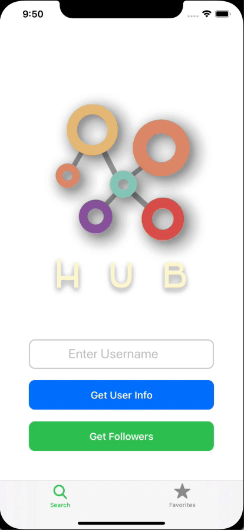
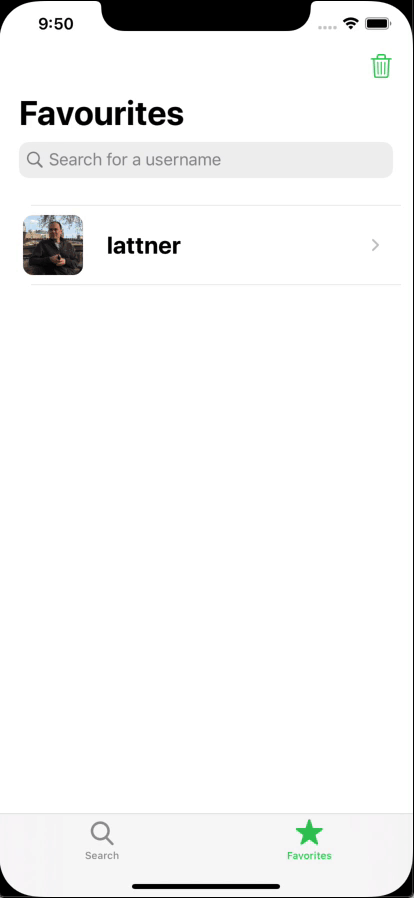
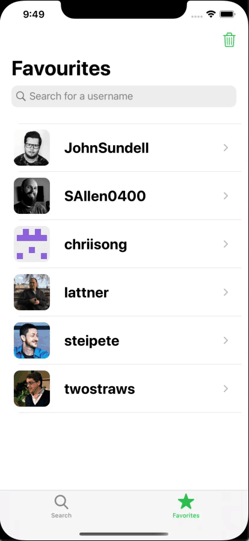

# Hub

[Hub](https://github.com/chriisong/GitHubFollowers) is a take-home project by [Sean Allen](https://github.com/sallen0400). It is a GitHub follower app that quickly searches for a list of followers for a given username using GitHub’s public API. With the retrieved followers list, users can further access the follower’s GitHub profile using SFSafariView and retrieve the follower’s own follower list. Upon completion of the course, I have added some additional features such as Core Data and CloudKit capabilities, additional view controllers for smoother user experience, and changing the `FavouritesVC` to be UITableViewDiffableSource. 

#### Technology: Diffable Data Source, Core Data, CloudKit, Result Type, REST API
#### 3rd Party Libraries: None

## Screen Recordings

### Core Data and CloudKit sync across devices of same iCloud account

### Core Data and UITableViewDiffableDataSource

### SafariServices

### Deleting UITableView Row with Snapshot and updating Core Data

### Deleting all UITableView Rows with Snapshot and updating Core Data

# Mango Care
**Mango Care** is a Personal Health Record app that enables patients to keep a well-organized record of their prescriptions, blood glucose values, blood pressure values, weight measurements, and clinic appointments, and set alerts to remind them to take their prescriptions, measure their health indices, and attend their appointments. Patients will then be able to share their data with their medical professionals in order to receive appropriate coaching and prescription adjusting to better suit their current health trend. SongCare stores all sensitive data in private CloudKit containers not only to keep the data secure, but also to allow ease of use when operating from different device. SongCare allows for unimpeded access to a patient’s own medical record and will play a bigger role in the growing telemedicine industry.

#### Technology: Core Data, CloudKit, UNNotification, Diffable Data Source, REST API
#### 3rd Party Libraries: FSCalendar, YPImagePicker, Charts

## Screen Recordings

### Adding Reminders and Editing Reminders

### Adding Lab Results using YPImagePicker

### Add Prescription

### REST API to download more drug data

### Updating Home view after making changes from other views

# TarkovMarket
**TarkovMarket** is a simple market information app for Battlestate Game’s Escape from Tarkov. It retrieves data using a 3rd party API service and displays it appropriately on UITableView and UICollectionView using the latest Diffable Data Source technology for responsive, reactive, and powerful performance. The app uses Core Data for persistence to enable users to favourite their desired items for quick access.

#### Technology: Core Data, CloudKit, Diffable Data Source, REST API, UIRefreshControl, ResultTypes
#### 3rd Party Libraries: None
#### TestFlight Public Link: https://testflight.apple.com/join/PQc27sZx

## Screen Recordings

### UIRefreshControl to update prices 

### Empty State View and updating Core Data Entity to toggle `isFavourited` property

### Using Diffable Data Source to filter search controller results

### Sorting Core Data objects using NSPredicate

