

# [mango CARE](https://github.com/chriisong/MangoCareDemo)
**mango CARE** is a Personal Health Record app that enables patients to keep a well-organized record of their prescriptions, blood glucose values, blood pressure values, weight measurements, blood oxygen saturation levels, and clinic appointments, and set alerts to remind them to take their prescriptions, measure their health indices, and attend their appointments. Patients will then be able to share their data with their medical professionals in order to receive appropriate coaching and prescription adjusting to better suit their current health trend. mango CARE stores all sensitive data using Core Data persistent containers to keep the data secure. mango CARE allows for unimpeded access to a patient’s own medical record and will play a bigger role in the growing telemedicine industry.

#### Technology: Core Data, CloudKit, UNNotification, Diffable Data Source, REST API, HealthKit, CareKit
#### 3rd Party Libraries: FSCalendar, Charts
#### TestFlight Public Link: https://testflight.apple.com/join/b5Bk1Zho

## Screenshots:

    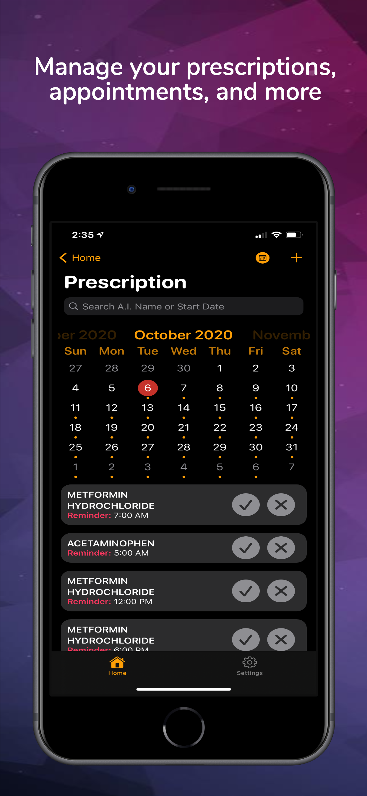
    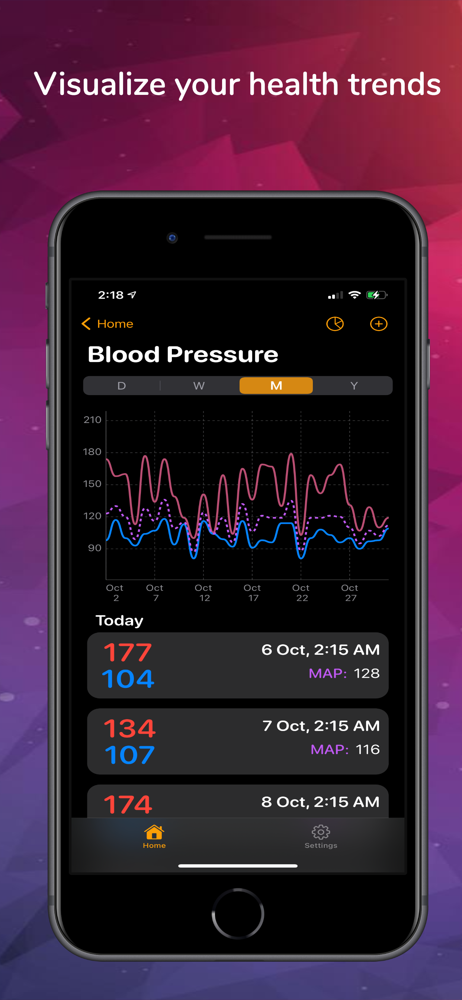
    
    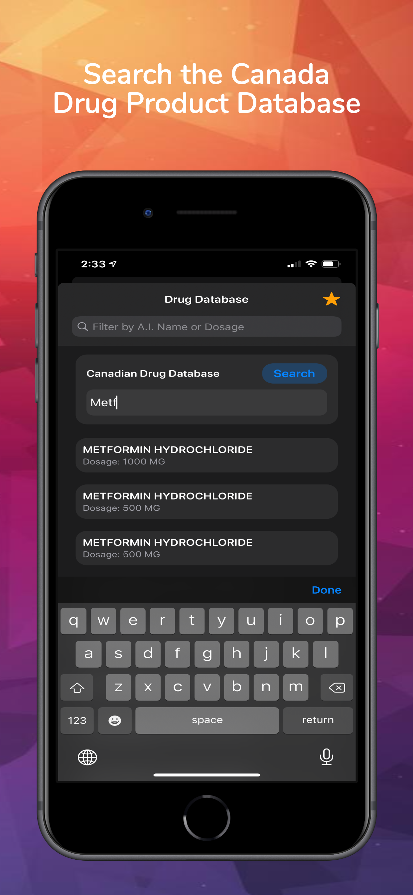
    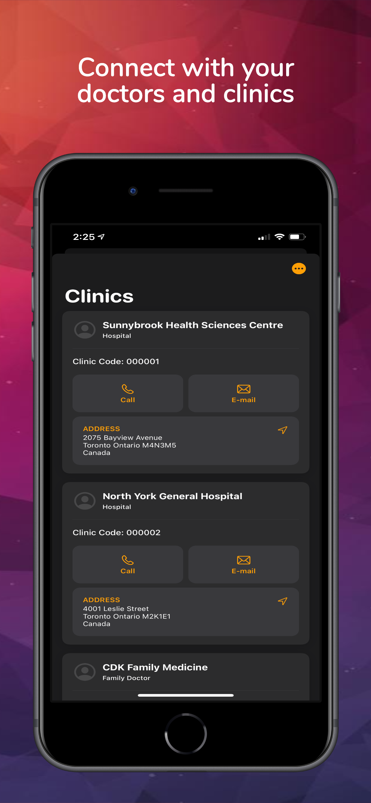
    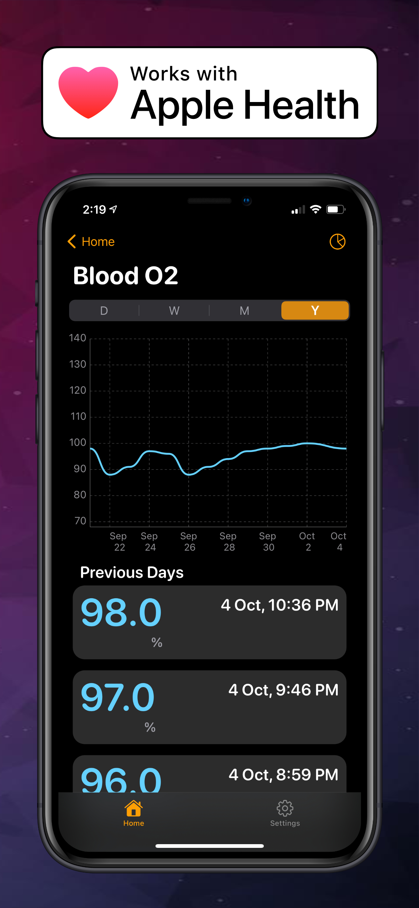

# [Hub](https://github.com/chriisong/GitHubFollowers)

[Hub](https://github.com/chriisong/GitHubFollowers) is a take-home project by [Sean Allen](https://github.com/sallen0400). It is a GitHub follower app that quickly searches for a list of followers for a given username using GitHub’s public API. With the retrieved followers list, users can further access the follower’s GitHub profile using SFSafariView and retrieve the follower’s own follower list. Upon completion of the course, I have added some additional features such as Core Data and CloudKit capabilities, additional view controllers for smoother user experience, and changing the `FavouritesVC` to be UITableViewDiffableSource. 

#### Technology: Diffable Data Source, Core Data, CloudKit, Result Type, REST API
#### 3rd Party Libraries: None

## Screenshots:

    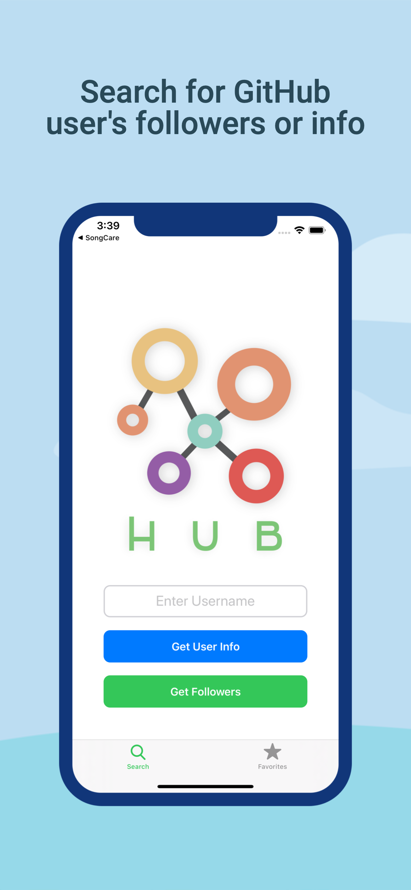
    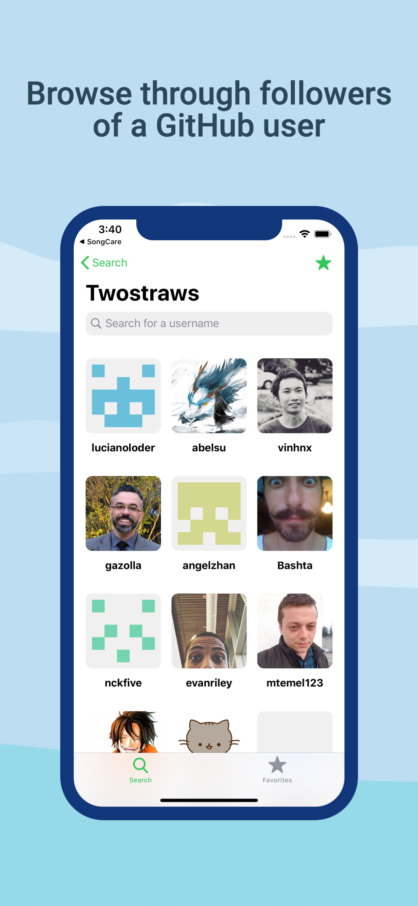
    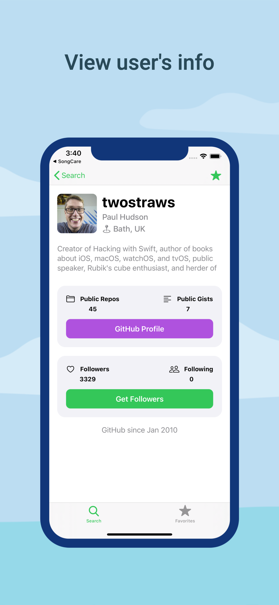
    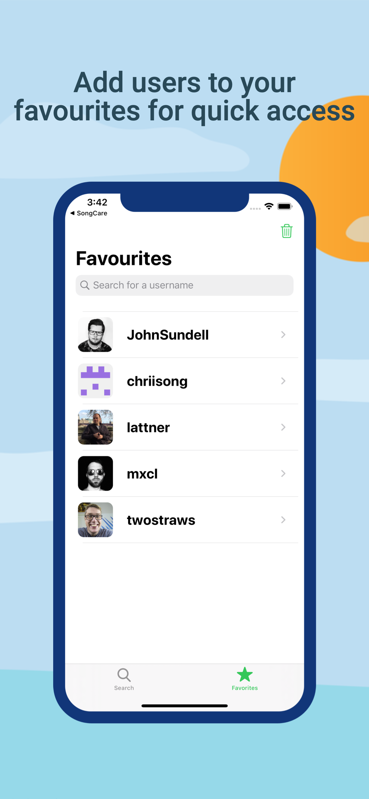
    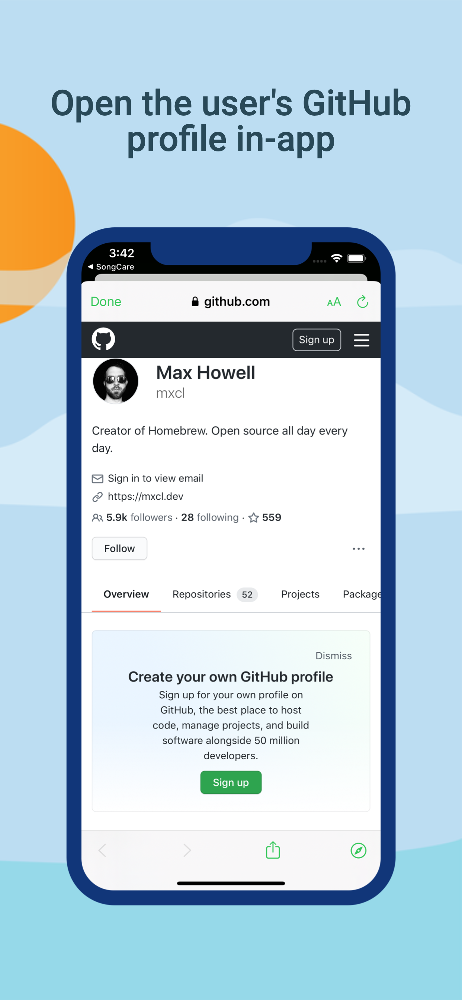

# [TarkovMarket](https://github.com/chriisong/TarkovMarketDemo)
**TarkovMarket** is a simple market information app for Battlestate Game’s Escape from Tarkov. It retrieves data using a 3rd party API service and displays it appropriately on UITableView and UICollectionView using the latest Diffable Data Source technology for responsive, reactive, and powerful performance. The app uses Core Data for persistence to enable users to favourite their desired items for quick access.

#### Technology: Core Data, CloudKit, Diffable Data Source, REST API, UIRefreshControl, ResultTypes
#### 3rd Party Libraries: None
#### TestFlight Public Link: https://testflight.apple.com/join/PQc27sZx

## Screenshots:

    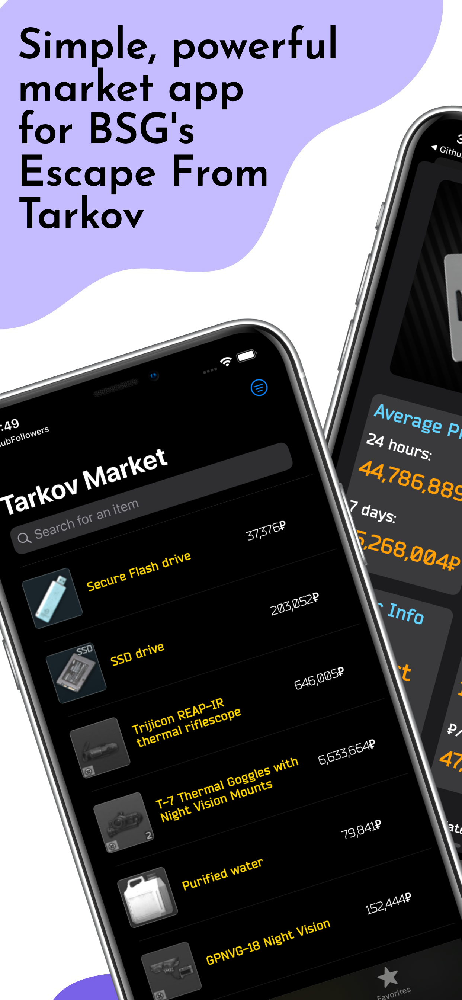
    
    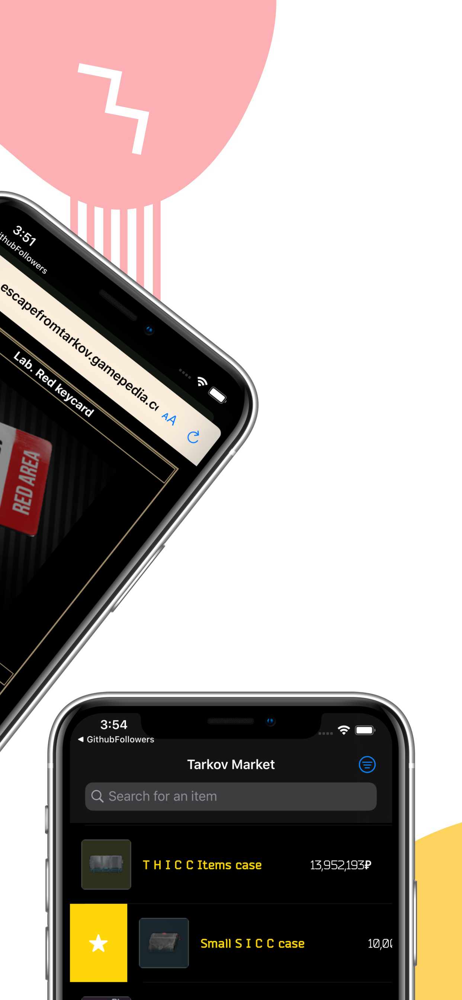
    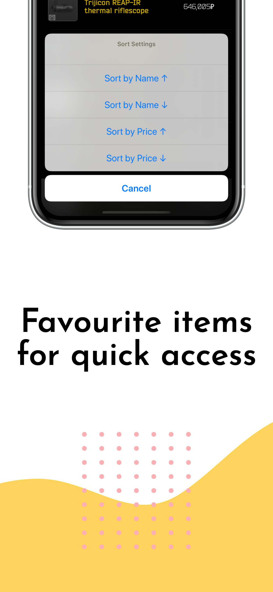
    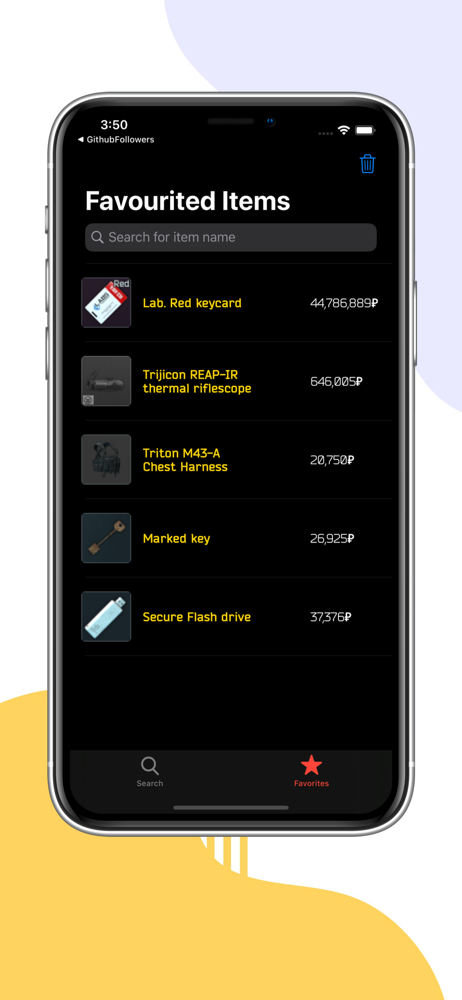

Preview images were created with <a href="https://previewed.app/">Previewed</a>
